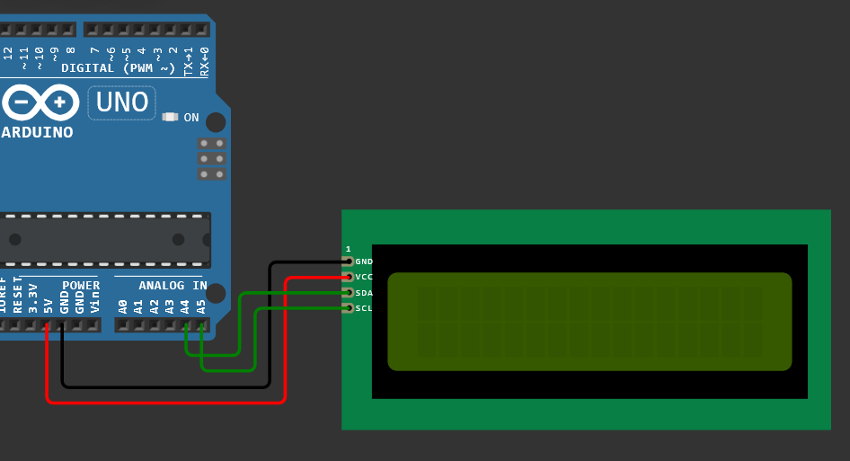

## Prueba básica de código para el servomotor

```Arduino
#include <Servo.h>

int servoPin = 2; // El servo necesita de un pin PWM
Servo miServo; // Creacion y nombre del servo
int servoAngulo = 0; // Angulo del incicio para testearlo

void setup() {
  miServo.attach(servoPin); // Carga el pin del servo
  Serial.begin(9600);
}

void loop() {
  servoAngulo = 0; //Siempre debe cargarse su posicion inicial en cero

  miServo.write(servoAngulo); // Posicion inicial de cero grados
  delay(2000);

  servoAngulo += 90; // Aumenta posicion a noventa grados
  miServo.write(servoAngulo);
  delay(2000);

  servoAngulo += 90; // Aumenta posisicion a ciento ochenta grados
  miServo.write(servoAngulo);
  delay(2000);

  servoAngulo -= 90; // Disminuye posicion a noventa grados
  miServo.write(servoAngulo);
  delay(2000);
}
```


Link para ver y probar la simulación: https://wokwi.com/projects/450923035980365825

---
## Prueba de funcionamiento y conexión LCD I2C
> breve bosquejo de funciones principales para realizar el laboratorio

```Arduino
#include <LiquidCrystal_I2C.h>

LiquidCrystal_I2C lcd(0x27, 16, 2);

byte N[8] = {
  0b00001110,
  0b00000000,
  0b00010001,
  0b00011001,
  0b00010101,
  0b00010011,
  0b00010001,
  0b00000000
};


String estadoATexto(byte estado){
  if(estado == HIGH){
    return "TODO ENCENDIDO";
  }
  else{
    return "TODO APAGADO";
  }
}


String velocidadATexto(byte velocidad){
  if(velocidad == 0){
    return "OFF ";
  }
  else if(velocidad > 0 && velocidad <= 85){
    return "BAJO ";
  }
  else if(velocidad > 85 && velocidad <= 170){
    return "MEDIO ";
  }
  else{
    return "ALTO";
  }
}


String puertaATexto(byte estadoPuerta){
  if(estadoPuerta==HIGH){
    return "ABIERTA ";
  }
  else{
    return "CERRADA ";
  }
}


void imprimir(String escena, byte estadoPuerta, byte estadoVentilador){
  lcd.clear();
  lcd.setCursor(0,0);
  if(escena.equals("BAÑO")){
    lcd.print("BA");
    lcd.write(0);
    lcd.print("O");
  }else{
    lcd.print(escena);
  }
  lcd.print(" PUERTA:");
  lcd.print(puertaATexto(estadoPuerta));
  lcd.print("VENTILADOR:");
  lcd.print(velocidadATexto(estadoVentilador));
}


void imprimir(String escena, byte estadoPuerta, byte estadoVentilador, byte estadoLeds){
  lcd.clear();
  lcd.setCursor(0,0);
  if(escena.equals("BAÑO")){
    lcd.print("BA");
    lcd.write(0);
    lcd.print("O");
  }else{
    lcd.print(escena);
  }
  lcd.print(" PUERTA:");
  lcd.print(puertaATexto(estadoPuerta));
  lcd.print("VENTILADOR:");
  lcd.print(velocidadATexto(estadoVentilador));
  lcd.setCursor(0,1);
  lcd.print(estadoATexto(estadoLeds));
}


void setup() {
  // put your setup code here, to run once:
  lcd.init();
  lcd.createChar(0, N);
  lcd.backlight();
  lcd.setCursor(0,0);
  imprimir("FIESTA", HIGH, 110, HIGH);
}


void loop() {
  // put your main code here, to run repeatedly:
  delay(500);
  lcd.scrollDisplayLeft();
}
```


[Accede a este circuito simulado! (haz clic en cualquier sitio azul)](https://wokwi.com/projects/450932545007138817)

---
## Prueba de funcionamiento del Motor DC con L293D

>Comandos para la EEPROM:  
>FAN0= Apagar  
>FAN1= Velocidad baja  
>FAN2= Velocidad media  
>FAN3= Velocidad alta  

```Arduino
#include <EEPROM.h>

#define PIN_RELE 9

// Variables 
byte velocidadApagada = 0; 
byte velocidadBaja = 85;
byte velocidadMedia = 170;
byte velocidadAlta = 255;

int estadoMotor = 0;

void setup() {
  Serial.begin(9600);
  pinMode(PIN_RELE, OUTPUT);

  estadoMotor = EEPROM.read(0);

  if (estadoMotor > 3) estadoMotor = 0;

  aplicarMotor();
}

void loop() {
  if (Serial.available()) {
    String termi = Serial.readStringUntil('\n'); //Guardar valor de terminal
    termi.trim();
    termi.toUpperCase();

    if (termi == "FAN0") cambiarEstado(0);
    else if (termi == "FAN1") cambiarEstado(1);
    else if (termi == "FAN2") cambiarEstado(2);
    else if (termi == "FAN3") cambiarEstado(3);
    else cambiarEstado(0);
  }
  delay(10);
}

void cambiarEstado(int nuevo) {
  estadoMotor = nuevo;
  EEPROM.update(0, estadoMotor);  // Guardar 
  aplicarMotor();
  
  Serial.print("FAN");
  Serial.print(estadoMotor);
  Serial.println(" guardado en EEPROM");
}

void aplicarMotor() {
  switch (estadoMotor) {
    case 0:  // FAN0
      digitalWrite(PIN_RELE, HIGH);
      Serial.println("MOTOR: APAGADO");
      break;
    case 1:  // FAN1
      digitalWrite(PIN_RELE, LOW);
      Serial.println("MOTOR: ENCENDIDO BAJO");
      break;
    case 2:  // FAN2
      digitalWrite(PIN_RELE, LOW);
      Serial.println("MOTOR: ENCENDIDO MEDIO");
      break;
    case 3:  // FAN3
      digitalWrite(PIN_RELE, LOW);
      Serial.println("MOTOR: ENCENDIDO ALTO");
      break;
  }
}
```


[Accede a este circuito simulado! (haz clic en cualquier sitio azul)](https://www.tinkercad.com/things/7qkBuMOths8-motor-dc-con-puente-h)


# Union de Componentes, Fase Final

> Esta prueba esta implementado con DIP Switch SPST simulando el funcionamiento por comando en Comunicación Serial que se implementará en la Casa Domotizada 

```  
    #include <Servo.h>
    #include <Wire.h> 
    #include <LiquidCrystal_I2C.h>

    #define pinServo 2
    #define pinMotor 3
    #define pinInterruptorMotor 4
    #define pinInterruptorServo 5
    #define pinL1 8
    #define pinL2 9
    #define pinL3 10
    #define pinL4 11
    #define pinL5 12

    int cont = 0;
    int contVentilador = 0;
    int contPuerta = 0;
    // Variables para Ventilador
    int valorPot = 0;
    int velocidadVentilador = 0;
    // Variables para Puerta
    Servo servoPuerta;
    bool abrirPuerta = false; // Angulo 0 false puerta cerrada
    int servoAngulo = 0;
    // Variable para LCD
    LiquidCrystal_I2C lcd(0x20, 16, 2);


    void setup(){
      Serial.begin(9600);
      pinMode(pinMotor, OUTPUT);
      pinMode(pinInterruptorMotor, INPUT);
      pinMode(pinInterruptorServo, INPUT);
      servoPuerta.attach(pinServo);
      servoPuerta.write(0);
      delay(1000);

    digitalWrite(pinL1, HIGH);
    digitalWrite(pinL2, HIGH);
    digitalWrite(pinL3, HIGH);
    digitalWrite(pinL4, HIGH);
    digitalWrite(pinL5, HIGH);
      
    lcd.init();
    lcd.clear();
    lcd.backlight();
    
    lcd.setCursor(0,0);
    lcd.print(" Bienvenido");
    delay(100);
    lcd.setCursor(0,1);
    lcd.print( " Listo para Iniciar" );
    }

    void loop(){
      if(cont <= 20){
        lcd.scrollDisplayLeft();
        delay(100);
        cont++;
      }
    
    
    //Control Puerta
    int estadoServo = digitalRead( pinInterruptorServo );// Leer estado actual del interruptor
      if( estadoServo == HIGH && !abrirPuerta ){
        
        Serial.println( "Abriendo puerta..." );
        if(contPuerta != 1){
          lcd.clear();
          lcd.print( "Abriendo Puerta" );
          contPuerta++;
        }
        servoAngulo = 90;
        servoPuerta.write( servoAngulo );
        delay(300);
        abrirPuerta = true;   
      } else if( estadoServo == LOW && abrirPuerta ){
        Serial.println( "Cerrando puerta..." );
        if(contPuerta != 0){
        lcd.clear();
        lcd.print( "Cerrando Puerta" );
        delay(100);
        contPuerta = 0;
        }
        servoAngulo = 0;
        servoPuerta.write( servoAngulo );
        delay(500);
        abrirPuerta = false;
      }
    
    
    //Control Ventilador
    int estadoMotor = digitalRead( pinInterruptorMotor );
      Serial.println(estadoMotor);
        if( estadoMotor == HIGH ){
          digitalWrite(pinMotor, HIGH);
          if(contVentilador != 1){
            lcd.clear();
            lcd.print( "Ventilador Encendido" );
            contVentilador++;
          }
          delay(100);
        }else{
          digitalWrite(pinMotor, LOW);
          if(contVentilador != 0){
          lcd.clear();
          lcd.print( "Ventilador Apagado" );
          delay(100);
          contVentilador = 0;
          }
        }
```

[https://www.tinkercad.com/things/hlgouVLsfX1-union-de-componentes](https://www.tinkercad.com/things/h0FTCla1Lwe/editel?sharecode=mTq7qzWr5xt4f_s4ksejkFeTj6Ktb6us_5swuHZ8ZWE)


# Código en Arduino IDE con implementación en Comunicación Serial, código para Casa Domotizada.

> CÓDIGO PROPORCIONADO CON AUXILIAR CON RETOQUES MENORES
```Arduino
// Importaciones de las Librerias
#include <Wire.h>
#include <LiquidCrystal_I2C.h>
#include <Servo.h>
#include <EEPROM.h>

// Pines de Salida
const int PIN_SALA = 2;
const int PIN_COMEDOR = 3;
const int PIN_COCINA = 4;
const int PIN_BANO = 5;
const int PIN_HAB = 6;
const int PIN_FAN = 9;  // Pin de PWM (potenciometro)
const int PIN_SERVO = 10;

// Objetos
LiquidCrystal_I2C lcd(0x27, 16, 2);
Servo puertaServo;


// Variables Globales a Utilizar
String comando = "";
int velocidadFan = 0;
bool puertaAbierta = false;
String nombreEscena = "Manual";
bool escenaActiva = false;

// EEPROM - Estableceer direcciones de memoria
const int DIR_FAN = 0;
const int DIR_PUERTA = 1;
const int DIR_ESCENA_ACTIVA = 2; 
const int DIR_NUM_PASOS = 10;
const int DIR_PASOS_BASE = 20;

// Variables Para el Sistema de Escenas
bool modoCarga = false;
String nombreNuevaEscena = "";
struct PasoEscena{
  byte pin;
  bool estado;
  unsigned int duracion; // en milisegundos
  byte repeticiones;
} pasosEscena[50]; // Arreglo Unidimensional o lo que llamamos normalmente vector 
int totalPasos = 0;
String escenasGuardadas[10]; // Nombres de escenas
int numEscenas = 0;


void setup() {
  // Inicializar el puerto serial
  Serial.begin(9600);

  // Configurar los pines creados anteriormente de Salida
  pinMode(PIN_SALA, OUTPUT);  
  pinMode(PIN_COMEDOR, OUTPUT);  
  pinMode(PIN_COCINA, OUTPUT);  
  pinMode(PIN_BANO, OUTPUT);  
  pinMode(PIN_HAB, OUTPUT);  
  pinMode(PIN_FAN, OUTPUT);  

  // Inicializar el periferico de Servo y LCD
  puertaServo.attach(PIN_SERVO);
  lcd.init();
  lcd.backlight();

  // Recuperacion del estado de la EEPROM
  recuperarEstado();
  actualizarLCD();

  // Mensajes a mostrar
  Serial.println("*** CASA AUTOMATIZADA DIC 2025 ***");
  Serial.println("\n");
}

void loop() {

  // Para manejar el ingreso comandos
  if (Serial.available() > 0){
    comando = Serial.readStringUntil('\n'); 
    comando.trim();
    comando.toUpperCase();
    interpretarComando(comando);
  }
 
  // Para manejar escenas activas , ejecutarlas.
  if (escenaActiva){
    //ejecutarEscenaNonBlocking();
    Serial.println("Escena activada");
  }

}


void interpretarComando(String cmd){
  // Flujo de control del comando
  
  // Control de comandos de luces
  if (cmd == "L1" || cmd == "L1ON") { digitalWrite(PIN_SALA,HIGH); Serial.println("SALA:ON"); }
  else if (cmd == "L1OFF") { digitalWrite(PIN_SALA,LOW); Serial.println("SALA:OFF"); }
  else if (cmd == "L2" || cmd == "L2ON") { digitalWrite(PIN_COMEDOR,HIGH); Serial.println("COMEDOR:ON"); }
  else if (cmd == "L2OFF") { digitalWrite(PIN_COMEDOR,LOW); Serial.println("COMEDOR:OFF"); }
  else if (cmd == "L3" || cmd == "L3ON") { digitalWrite(PIN_COCINA,HIGH); Serial.println("COCINA:ON"); }
  else if (cmd == "L3OFF") { digitalWrite(PIN_COCINA,LOW); Serial.println("COCINA:OFF"); }
  else if (cmd == "L4" || cmd == "L4ON") { digitalWrite(PIN_BANO,HIGH); Serial.println("BANO:ON"); }
  else if (cmd == "L4OFF") { digitalWrite(PIN_BANO,LOW); Serial.println("BANO:OFF"); }
  else if (cmd == "L5" || cmd == "L5ON") { digitalWrite(PIN_HAB,HIGH); Serial.println("HAB:ON"); }
  else if (cmd == "L5OFF") { digitalWrite(PIN_HAB,LOW); Serial.println("HAB:OFF"); }
  else if (cmd == "ALLON") { allOn(); Serial.println("TODAS:ON"); }
  else if (cmd == "ALLOFF") { allOff(); Serial.println("TODAS:OFF"); }

  // Control de comandos de motor
  else if (cmd == "FAN0") { setVentilador(0); }
  else if (cmd == "FAN1") { setVentilador(85); }
  else if (cmd == "FAN2") { setVentilador(170); }
  else if (cmd == "FAN3") { setVentilador(255); }

  // Control de la puerta
  else if (cmd == "DOOR") { togglePuerta(); }
  else if (cmd == "DOOROPEN") { moverPuerta(true); }
  else if (cmd == "DOORCLOSE") { moverPuerta(false); }

  // Control de Escenas
  else if (cmd == "FIESTA") { cargarEscenaPredefinida(1); }
  else if (cmd == "RELAX") { cargarEscenaPredefinida(2); }
  else if (cmd == "NIGHT") { cargarEscenaPredefinida(3); }

  // Control de Cargo de Escenas
  else if (cmd == "LOAD_SCENE") {
    modoCarga = true;
    totalPasos = 0;
    Serial.println("* MODO CARGA ACTIVADO *");
    Serial.println("Agrega tus lineas del .org, debe terminar con END_LOAD NOMBRE");
  }
  else if(modoCarga){
    procesarLineaEscena(cmd);
  }

  // Control del Sistema
  else if(cmd == "STOP"){
    escenaActiva = false;
    nombreEscena = "Manual";
    Serial.println("ESCENA DETENIDA");
  }
  else if(cmd == "STATUS"){ imprimirEstado(); }
  else if(cmd == "RESET"){ resetSistema(); }
  else if(cmd == "VERSION"){Serial.println("Casa Dic 2025");}
  else if(cmd == "LIST_SCENES"){ listarEscenas(); }
  else {Serial.println("--> Comando Desconocido 😢");}

  actualizarLCD();
  guardarEstadoActual();

}

void setVentilador (int pwm){
  analogWrite(PIN_FAN, pwm);
  velocidadFan = pwm;
  Serial.print("FAN: "); Serial.println(pwm);
}

void moverPuerta(bool abrir){
  puertaAbierta = abrir;
  puertaServo.write(abrir ? 90:0);
  Serial.print("PUERTA: "); Serial.println(abrir ? "ABIERTA" : "CERRADA");
}

void togglePuerta(){ moverPuerta(!puertaAbierta); }

void allOn(){
  digitalWrite(PIN_SALA, HIGH);
  digitalWrite(PIN_COMEDOR, HIGH);
  digitalWrite(PIN_COCINA, HIGH);
  digitalWrite(PIN_BANO, HIGH);
  digitalWrite(PIN_HAB, HIGH);
}

void allOff(){
  digitalWrite(PIN_SALA, LOW);
  digitalWrite(PIN_COMEDOR, LOW);
  digitalWrite(PIN_COCINA, LOW);
  digitalWrite(PIN_BANO, LOW);
  digitalWrite(PIN_HAB, LOW);
}

//# Escena: FIESTA
//# Descripcion: Luces parpadeando rapidamente en patron alternado
//# Duracion total aproximada: 20 segundos
//
//SALA:ON:500:20  // pos1= SALA  pos2 =ON pos3= 500 pos3+1= 20
//COMEDOR:OFF:500:20
//COCINA:ON:300:30
//BAÑO:OFF:300:30
//HABITACION:ON:200:50

void procesarLineaEscena(String linea){ 
  linea.trim();
  // Estructurar posiciones de la linea
  if (linea.startsWith("#") || linea.length() == 0) return;
  if (linea.startsWith("END_LOAD")){
    nombreNuevaEscena = linea.substring(8);
    nombreNuevaEscena.toUpperCase();
    modoCarga = false;
    guardarEscenaEnEEPROM();
    return;
  }
  int pos1 = linea.indexOf(':');
  int pos2 = linea.indexOf(':', pos1 + 1);
  int pos3 = linea.indexOf(':', pos2 + 1);

  // Obtener datos del Ambiente
  if(pos1 > 0 && pos2 > pos1 && pos3 > pos2 && totalPasos < 50 ){
    String amb = linea.substring(0, pos1);
    String est = linea.substring(pos1 + 1, pos2);
    int dur = linea.substring(pos2 + 1, pos3).toInt();
    int rep = linea.substring(pos3 + 1).toInt();

    // Mapeo de Ambiente a pin
    byte pin = getPinFromAmbiente(amb);
    if(pin > 0){
      pasosEscena[totalPasos].pin = pin;
      pasosEscena[totalPasos].estado = (est == "ON");
      pasosEscena[totalPasos].duracion = dur;
      pasosEscena[totalPasos].repeticiones = rep;
      totalPasos++;
      Serial.print(" -> Linea Agregada");
    }
  }
}

byte getPinFromAmbiente(String amb){
  if(amb == "SALA") return PIN_SALA;
  if(amb == "COMEDOR") return PIN_COMEDOR;
  if(amb == "COCINA") return PIN_COCINA;
  if(amb == "BANO") return PIN_BANO;
  if(amb == "HABITACION" || amb == "HAB") return PIN_HAB;
  return 0;
}

void guardarEscenaEnEEPROM(){
  //Guardar el nombre de cada escena
  escenasGuardadas[numEscenas] = nombreNuevaEscena;
  numEscenas++;

  // Guardar pasos (4 bytes por paso)
  EEPROM.update(DIR_NUM_PASOS, totalPasos);
  for(int i = 0; i < totalPasos; i++){
    int addr = DIR_PASOS_BASE + (i * 4);
    EEPROM.update(addr, pasosEscena[i].pin);
    EEPROM.update(addr + 1, pasosEscena[i].estado);
    EEPROM.update(addr + 2, lowByte(pasosEscena[i].duracion));
    EEPROM.update(addr + 3, highByte(pasosEscena[i].duracion));
    EEPROM.update(addr + 4, pasosEscena[i].repeticiones);
  }
}

void recuperarEstado(){
  velocidadFan = EEPROM.read(DIR_FAN);
  puertaAbierta = EEPROM.read(DIR_PUERTA);
  int escenaId = EEPROM.read(DIR_ESCENA_ACTIVA);
  setVentilador(velocidadFan);
  moverPuerta(puertaAbierta);
  Serial.println("Estado Recuperado desde la EEPROM");

}

void guardarEstadoActual(){
  EEPROM.update(DIR_FAN, velocidadFan);
  EEPROM.update(DIR_PUERTA, puertaAbierta);
}

void actualizarLCD(){
  lcd.clear();
  lcd.setCursor(0,0);
  lcd.print("Escena: ");
  lcd.print(nombreEscena);

  lcd.setCursor(0,1);
  if (velocidadFan == 0) lcd.print("FAN:OFF ");
  else if (velocidadFan < 100) lcd.print("FAN:BAJO ");
  else if (velocidadFan < 170) lcd.print("FAN:MEDIO ");
  else lcd.print("FAN:ALTO ");

  lcd.print(puertaAbierta ? "PUERTA:ABIERTA" : "PUERTA:CERRADA");
}

void imprimirEstado(){
  Serial.println("*** ESTADO ACTUAL DEL SISTEMA ***");
  Serial.print("SALA : "); Serial.println(digitalRead(PIN_SALA) ? "ON" : "OFF");
  Serial.print("COMEDOR : "); Serial.println(digitalRead(PIN_COMEDOR) ? "ON" : "OFF");
  Serial.print("COCINA : "); Serial.println(digitalRead(PIN_COCINA) ? "ON" : "OFF");
  Serial.print("BANO : "); Serial.println(digitalRead(PIN_BANO) ? "ON" : "OFF");
  Serial.print("HAB : "); Serial.println(digitalRead(PIN_HAB) ? "ON" : "OFF");
  Serial.print("FAN : "); Serial.println(velocidadFan);
  Serial.print("PUERTA : "); Serial.println(puertaAbierta ? "ON" : "OFF");
  Serial.print("ESCENA : "); Serial.println(nombreEscena);
}

void resetSistema(){
  allOff();
  setVentilador(0);
  moverPuerta(false);
  escenaActiva = false;
  nombreEscena = "Reset";
  Serial.println("*** Sistema Reiniciado ***");
}

void listarEscenas(){
  Serial.println("*** Escenas Guardadas ***");
  for(int i = 0; i < numEscenas; i++){
    Serial.print(" >."); Serial.println(escenasGuardadas[i]);
  }
}

void cargarEscenaPredefinida(int id){
  nombreEscena = (id == 1) ? "Fiesta" : (id==2) ? "Relax" : "Noche";
  escenaActiva = true;
  Serial.print("  - "); Serial.println(nombreEscena); 
}
```
